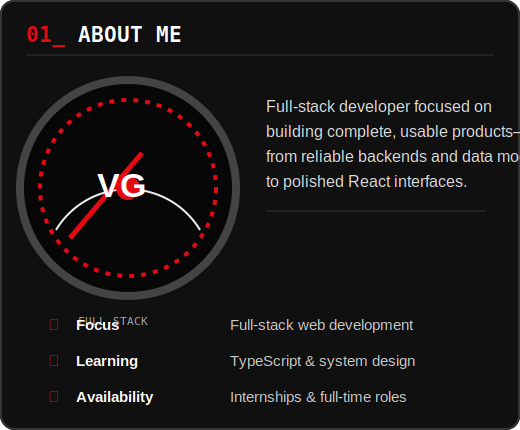
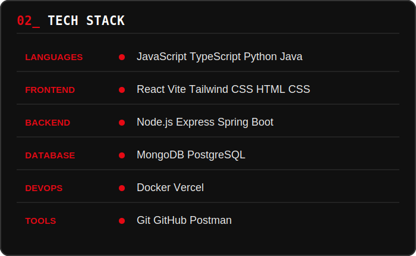
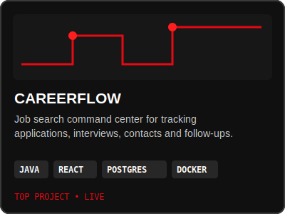
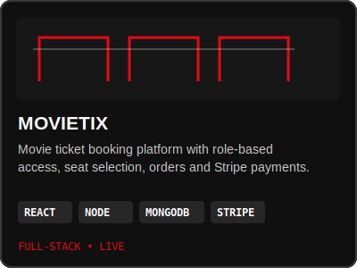
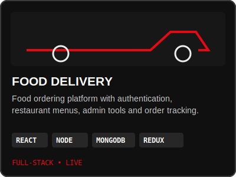
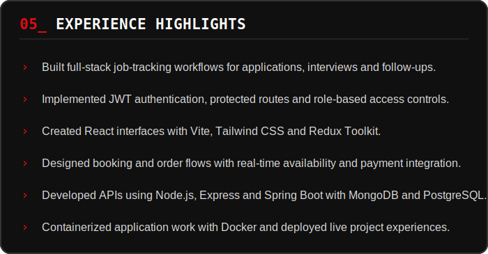
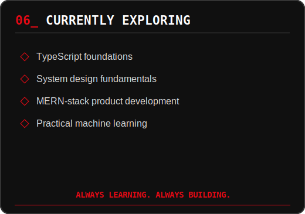

<code>› VG_01.README</code> &nbsp;&nbsp;&nbsp; <code>› BUILDING SOLUTIONS. <b>DRIVING IMPACT.</b></code>

<table>
  <tr>
    <td width="45%" valign="middle">
      <h1>VANSH GARG</h1>
      
<b>FULL-STACK DEVELOPER</b>

      
Building complete products, from data models to polished interfaces that solve real problems.

        
      
      
    </td>
    <td width="55%" valign="middle">
      
    </td>
  </tr>
</table>

 

<table>
  <tr>
    <td width="42%" valign="top"></td>
    <td width="58%" valign="top"></td>
  </tr>
</table>

 

## 

<table>
  <tr>
    <td width="33%" valign="top">
      
       <a href="https://github.com/VKGarg7/CareerFlow">VIEW CODE ↗</a> · <a href="https://career-flow-chi.vercel.app">LIVE DEMO ↗</a>
    </td>
    <td width="33%" valign="top">
      
       <a href="https://github.com/VKGarg7/MovieTix">VIEW CODE ↗</a> · <a href="https://movietix-rho.vercel.app/">LIVE DEMO ↗</a>
    </td>
    <td width="33%" valign="top">
      
       <a href="https://github.com/VKGarg7/Food_Delivery_Website">VIEW CODE ↗</a> · <a href="https://food-delivery-website-one-chi.vercel.app">LIVE DEMO ↗</a>
    </td>
  </tr>
</table>

 

## 

  
  
   
  

 

<table>
  <tr>
    <td width="58%" valign="top"></td>
    <td width="42%" valign="top"></td>
  </tr>
</table>

 

## 

> “Great code is not just written; it’s engineered with purpose.”

  
  
  

 

  

README asset notes

The dashboard uses original SVG artwork. See [asset instructions](./assets/README-ASSETS.md) to replace the optional vehicle and profile placeholders with supplied images.

