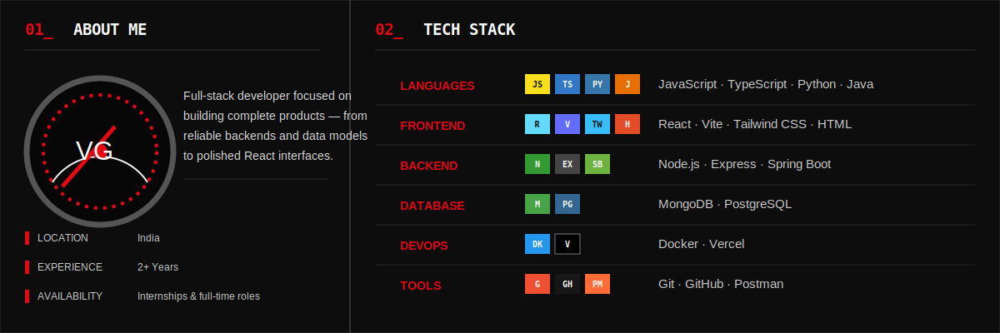
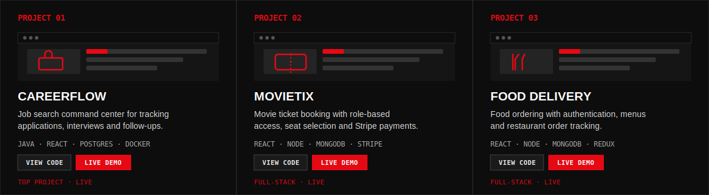
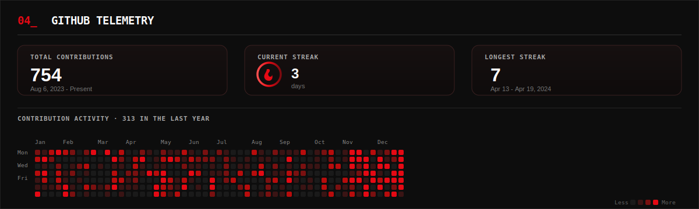
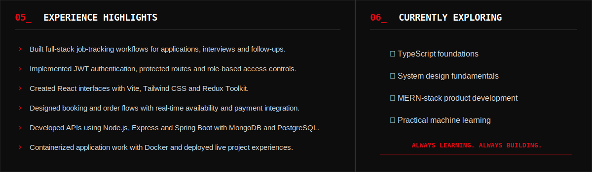
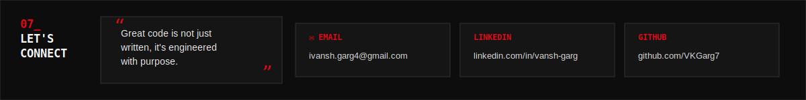
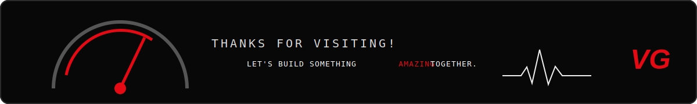

<table align="center" width="100%" cellpadding="0" cellspacing="0" border="0" style="border-collapse:collapse;background:#0d0d0d;">
<tr><td style="padding:0;line-height:0;">

</td></tr>
<tr><td align="center" style="background:#0d0d0d;padding:14px 0;border:1px solid #343434;border-top:none;">

&nbsp;

&nbsp;

  
<a href="https://github.com/VKGarg7">GITHUB</a> &nbsp;·&nbsp; <a href="https://www.linkedin.com/in/vansh-garg-bb5060202/">LINKEDIN</a>
</td></tr>
</table>

---

---

## 03_ FEATURED PROJECTS

[CAREERFLOW — CODE](https://github.com/VKGarg7/CareerFlow) · [LIVE DEMO](https://career-flow-chi.vercel.app) &nbsp;&nbsp;|&nbsp;&nbsp; [MOVIETIX — CODE](https://github.com/VKGarg7/MovieTix) · [LIVE DEMO](https://movietix-rho.vercel.app/) &nbsp;&nbsp;|&nbsp;&nbsp; [FOOD DELIVERY — CODE](https://github.com/VKGarg7/Food_Delivery_Website) · [LIVE DEMO](https://food-delivery-website-one-chi.vercel.app)

---

## 04_ GITHUB TELEMETRY

---

---

## 07_ LET'S CONNECT

[EMAIL](mailto:ivansh.garg4@gmail.com) &nbsp;·&nbsp; `IVANSH.GARG4@GMAIL.COM` &nbsp;&nbsp; [LINKEDIN](https://www.linkedin.com/in/vansh-garg-bb5060202/) &nbsp;·&nbsp; `VANSH-GARG` &nbsp;&nbsp; [GITHUB](https://github.com/VKGarg7) &nbsp;·&nbsp; `VKGARG7`

---

